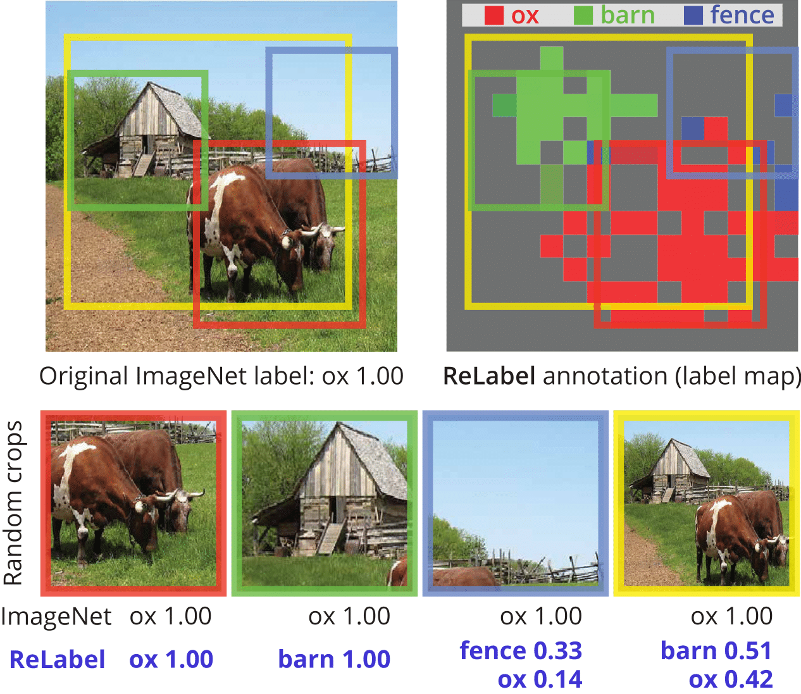

## Re-labeling ImageNet: from Single to Multi-Labels, from Global to Localized Labels 

Official PyTorch implementation of **Re-labeling ImageNet** | [Paper](https://arxiv.org/abs/2101.05022) | [Pretrained Models](#experiments) 

**[Sangdoo Yun](https://sangdooyun.github.io/), Seong Joon Oh, Byeongho Heo, Dongyoon Han, Junsuk Choe, Sanghyuk Chun**

NAVER AI LAB

</img>

### Abstract
ImageNet has been arguably the most popular image classification benchmark, but it is also the one with a significant level of label noise. 
Recent studies have shown that many samples contain multiple classes, despite being assumed to be a single-label benchmark. They have thus proposed to turn ImageNet evaluation into a multi-label task, with exhaustive multi-label annotations per image.
However, they have not fixed the training set, presumably because of a formidable annotation cost. 
We argue that the mismatch between single-label annotations and effectively multi-label images is equally, 
if not more, problematic in the training setup, where random crops are applied. 
With the single-label annotations, a random crop of an image may contain an entirely different object from the ground truth, 
introducing noisy or even incorrect supervision during training. 
We thus re-label the ImageNet training set with multi-labels. 
We address the annotation cost barrier by letting a strong image classifier, 
trained on an extra source of data, generate the multi-labels. We utilize the pixel-wise multi-label predictions before the final pooling layer, 
in order to exploit the additional location-specific supervision signals. 
Training on the re-labeled samples results in improved model performances across the board. 
ResNet-50 attains the top-1 classification accuracy of **78.9%** on ImageNet with our localized multi-labels, 
which can be further boosted to **80.2%** with the CutMix regularization. 
We show that the models trained with localized multi-labels also outperforms the baselines on transfer learning to object detection and instance segmentation tasks, 
and various robustness benchmarks.


## Updates
- **Jan 10, 2021**: Initial upload

## Installation
### Dependancies
Our implementations are tested on the following libraries with Python 3.6.9 and CUDA 10.1. 
```
torch: 1.6.0
torchvision: 0.7.0
apex: 0.1
munch: 2.5.0
adamp: 0.2.0
fire: 0.3.1
pyyaml: 5.3.1
```

Install PyTorch and Torchvision as following [official PyTorch instruction](https://pytorch.org/get-started/locally/)
```bash
conda install pytorch==1.6.0 torchvision==0.7.0 cudatoolkit=10.1 -c pytorch
```

Install other dependencies using the following command.
```bash
pip install -r requirements.txt
```
### Dataset
1. Download the original ImageNet dataset and place it in `--data.data_path` directory. 
2. Download [relabel_imagenet.tar (12GB)](https://www.dropbox.com/s/9sxigpec7fxq8wh/relabel_imagenet.tar?dl=0) and extract it in `--data.relabel.path` directory.

The ReLabel's structure is the same as ImageNet (ILSVRC) dataset's.  
```
root
 └─── n04355338
          └───── n04355338_22023.pt
          └───── n04355338_2663.pt
          └───── ...
 └─── n03786901
          └───── n03786901_5410.pt
          └───── ...
 └─── ...
```
                                              
## How to Run

### Train a model with ReLabel
- We used four NVIDIA V100 GPUs.
- Train ResNet-50 with **ReLabel** to obtain **78.9%** top-1 accuracy. 
```bash
python main.py --config-file-path configs/relabel_train_resnet50.yaml \
               --data.relabel.path 'path/to/relabel'
```
- Train ResNet-50 with **ReLabel+CutMix** to obtain **80.2%** top-1 accuracy. 
```bash
python main.py --config-file-path configs/relabel_train_resnet50_cutmix.yaml \
               --data.relabel.path 'path/to/relabel'
```

### Test a pretrained model
- For example, download [pretrained ResNet-50 model (78.9%)](https://www.dropbox.com/s/a0jzq3933s1wcig/rn50_relabel_78.9.pth?dl=0) to `path/to/checkpoint`. 
```bash
python main.py --config-file-path configs/relabel_train_resnet50.yaml \
               --util.test_only True \
               --util.test_weight_file 'path/to/checkpoint'
```

### Arguments
- `--config-file-path`: Path to config file (.yaml) which overrides `configs/base.yaml`.
- `--model.arch`: Network architecture provided by [torchvision](https://pytorch.org/docs/stable/torchvision/models.html) (Default: resnet50)
- `--data.data_path`: Path to the original ImageNet dataset (Default: '/home/data/ILSVRC2015/')
- `--data.relabel.use`: Use ReLabel ground truth (Default: True)
- `--data.relabel.path`: Path to ReLabel annotations 
- `--data.cutmix.prob`: Probability to apply [CutMix](https://github.com/clovaai/CutMix-PyTorch) regularizer (Default: 0.0)
- `--data.cutmix.beta`: Hyper-parameter for [CutMix](https://github.com/clovaai/CutMix-PyTorch) regularizer (Default: 0.0)
- `--data.cutmix.off_epoch`:  How many last epochs to train without [CutMix](https://github.com/clovaai/CutMix-PyTorch) regularizer (Default: 5) 
- `--optim.optimizer`: Name of optimizer. sgd and [AdamP](https://github.com/clovaai/AdamP) optimizers are available (Default: sgd) 
- `--optim.epochs`: Total epochs to train (Default: 100)
- `--optim.start_epoch`: Starting epoch for restarts
- `--optim.batch_size`: Mini-batch size of all GPUs (Default: 512)
- `--optim.lr.init`: Initial learning rate
- `--optim.lr.decay_type`: Type of learning rate decay (Default: cos)
- `--optim.wd.base`: Weight decay
- `--optim.warmup.lr`: Initial warmup learning rate (Default: 0.0)
- `--optim.warmup.epochs`: Warmup epochs (Default: 5)
- `--optim.nesterov`: Enable Nesterov momentum (Default: True)
- `--optim.momentum`: Momentum parameter (Default: 0.9)
- `--optim.label_smoothing`: Label smoothing parameter (Default: 0.0)
- `--util.test_only`: Only evaluate model without training (Default: False) 
- `--util.test_weight_file`: Path to the model file to be evaluated

<h2 id="experiments">Performances and Pretrained Models</h2> 

- ResNet-50 results on single-label and multi-label evalutation for ImageNet classficiation

Method | ImageNet | [ImageNetV2](http://proceedings.mlr.press/v97/recht19a/recht19a.pdf) | [ReaL](https://github.com/google-research/reassessed-imagenet) | [Shankar et al.](http://proceedings.mlr.press/v119/shankar20c/shankar20c.pdf)
-- | -- | -- | -- | -- 
ResNet-50 | 77.5 | 79.0 | 83.6 | 85.3 
ResNet-50 + [Label smoothing (e=0.1)](https://www.cv-foundation.org/openaccess/content_cvpr_2016/papers/Szegedy_Rethinking_the_Inception_CVPR_2016_paper.pdf) | 78.0 | 79.5 | 84.0 | 84.7 
ResNet-50 + [Label cleaning](https://github.com/google-research/reassessed-imagenet) | 78.1 | 79.1 | 83.6 | 85.2 
ResNet-50 + **ReLabel** | **78.9** | **80.5** | **85.0** | **86.1** 

- **ReLabel** on various architectures

Method | ImageNet GT | ReLabel GT
-- | -- | -- 
ResNet-18 | 71.7 | **72.5 (+0.8)** [[model_file]](https://www.dropbox.com/s/9tqslul5lik4h63/rn18_relabel_72.5.pth?dl=0)
ResNet-50 | 77.5 | **78.9 (+1.4)** [[model_file]](https://www.dropbox.com/s/a0jzq3933s1wcig/rn50_relabel_78.9.pth?dl=0)
ResNet-101 | 78.1 | **80.7 (+2.6)** [[model_file]](https://www.dropbox.com/s/y506p4tzy5cevts/rn101_relabel_80.7.pth?dl=0)
[ReXNet (x1.0)](https://github.com/clovaai/rexnet) | 77.9 | **78.4 (+0.5)**
EfficientNet-B0 | 77.4 | **78.0 (+0.6)**
EfficientNet-B1 | 79.2 | **80.3 (+1.1)**
EfficientNet-B2 | 80.3 | **81.0 (+0.7)**
EfficientNet-B3 | 81.7 | **82.5 (+0.8)**


- **ReLabel** with additional tricks

Method | ImageNet 
-- | --
ResNet-18 | 71.7
ResNet-18 + **ReLabel** | **72.5 (+0.8)** [[model_file]](https://www.dropbox.com/s/9tqslul5lik4h63/rn18_relabel_72.5.pth?dl=0)
ResNet-18 + **ReLabel** + [CutMix](https://github.com/clovaai/CutMix-PyTorch) | **73.2 (+1.5)** [[model_file]](https://www.dropbox.com/s/d2i1sjydih2lfym/rn18_relabel_cutmix_73.2.pth?dl=0) 
ResNet-50 | 77.5 
ResNet-50 + **ReLabel** | **78.9 (+1.4)** [[model_file]](https://www.dropbox.com/s/a0jzq3933s1wcig/rn50_relabel_78.9.pth?dl=0)
ResNet-50 + **ReLabel** + [CutMix](https://github.com/clovaai/CutMix-PyTorch) | **80.2 (+2.7)** [[model_file]](https://www.dropbox.com/s/6bmnjshu5bi6qeu/rn50_relabel_cutmix_80.2.pth?dl=0)
ResNet-50 + **ReLabel** + [CutMix](https://github.com/clovaai/CutMix-PyTorch) + ImageNet-21K | **81.2 (+3.7)** [[model_file]](https://www.dropbox.com/s/wzov0rk6ug6uxnq/rn50_relabel_cutmix_IN21k_81.2.pth?dl=0)
ResNet-101 | 78.1 
ResNet-101 + **ReLabel** | **80.7 (+2.6)** [[model_file]](https://www.dropbox.com/s/y506p4tzy5cevts/rn101_relabel_80.7.pth?dl=0)
ResNet-101 + **ReLabel** + [CutMix](https://github.com/clovaai/CutMix-PyTorch) | **81.6 (+3.5)** [[model_file]](https://www.dropbox.com/s/xep7l1dufvvcgm7/rn101_relabel_cutmix_81.6.pth?dl=0)


## License

```
Copyright 2021-present NAVER Corp.

Licensed under the Apache License, Version 2.0 (the "License");
you may not use this file except in compliance with the License.
You may obtain a copy of the License at

    http://www.apache.org/licenses/LICENSE-2.0

Unless required by applicable law or agreed to in writing, software
distributed under the License is distributed on an "AS IS" BASIS,
WITHOUT WARRANTIES OR CONDITIONS OF ANY KIND, either express or implied.
See the License for the specific language governing permissions and
limitations under the License.
```

## Citation
```
@article{yun2021relabling,
    title={Re-labeling ImageNet: from Single to Multi-Labels, from Global to Localized Labels},
    author={Yun, Sangdoo and Oh, Seong Joon and Heo, Byeongho and Han, Dongyoon and Choe, Junsuk and Chun, Sanghyuk},
    year={2021},
    journal={arXiv preprint arXiv:2101.05022},
}
```
